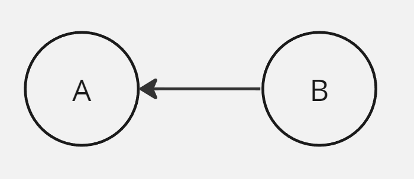
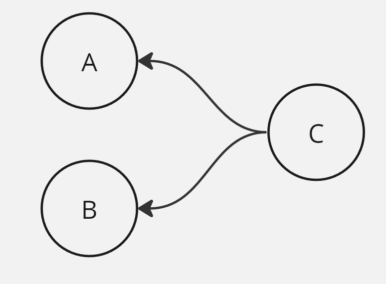
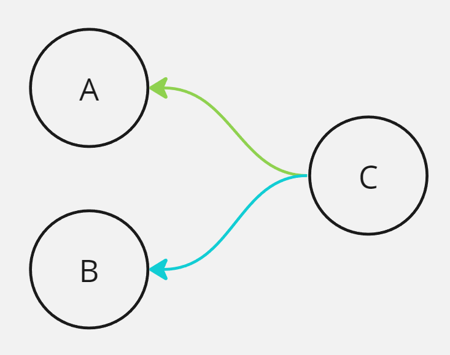
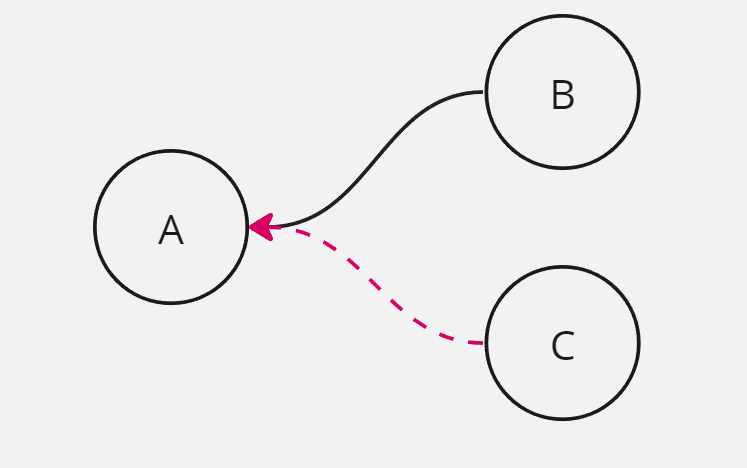

# Promises Training

Currently, promises are the de-facto way of handling asynchronous tasks in Javascript, and because of that, they're a fundamental part of any Javascript developer's knowledge.

However, when we're learning promises for the first time, we only learn **enough to get by**, that is, we learn a little bit of how to use promises, (nowadays, most likely with `async/await` only), the `Promise.all` method and that's it.

While this approach makes sense for beginners because it is enough to solve most problems in their daily lives, a recurring issue is that they **stop there**, that is, they never go past this initial knowledge.

And it's precisely this "learn just enough to get by" posture that holds many developers at their current level, as solving more complex problems requires a deeper understanding.

So, if you want to take your developer skills to the **next level**, swimming in shallow waters **won't cut it**, you **must go deeper**, you need to fully understand promises, and how they work, you need to be proficient in both `async/await` and `then/catch` styles of promise handling, and be able to orchestrate asynchronous tasks in the most efficient way possible.

Also, as promises are ultimately an abstraction to handle asynchronous tasks, being able to tackle common problems related to asynchronous programming is a must.

With that in mind, we created this project precisely to help you do this deep dive into promises and asynchronous programming.

By providing both explanations and practical exercises surrounding these topics, this project aims to be your companion in this journey to master them.

Even if you're already a seasoned developer, you might learn a thing or two, like, for example, you might want to try solving `concrete/parallelMaxConcurrency`, `concrete/concurrencyOverride`, `concrete/extractingResolvers` and `/foundation/promise` as they present some interesting challenges.

_Disclaimer: This project is not intended for people who are learning promises for the first time, as it assumes that you have at least some basic knowledge of promises, what they represent and how to use them both with `async/await` and `then/catch`._

## Table of Contents

- [Getting Started](#getting-started)
- [Levels](#levels)
- [Tests](#tests)
- [Exercises](#exercises)
  - [Graph Exercises](#graph-exercises)
  - [Concrete Exercises](#concrete-exercises)
  - [Foundation Exercises](#foundation-exercises)

## Getting Started

**ATTENTION: DO NOT CLONE THIS REPO UNLESS YOU'RE CONTRIBUTING**

First, to install the project, run:

```sh
npm create promises-training@latest
```

This project is exercise-driven, so the main goal is to solve them.

Occasionally, there will be explanations along with the exercises to help you understand what needs to be done, and also some context about the problem being solved.

Exercises are divided into three categories:

- Graph -> Exercises that involve orchestrating tasks according to dependency graphs.
- Concrete -> Exercises that simulate real-world problems.
- Foundation -> Exercises based on the foundations of promises and their implementation and common helpers.

Exercises are located within `src/exercises/<category>` folders, where `<category>` is one of the categories mentioned above.

For **graph** exercises, the base explanations are located in this README, in the yadayadayada section, and for each exercise, there is a `graph.png` that depicts the dependency graph for that specific exercise.

For **concrete** and **foundation** exercises, the explanations are located in the `README.md` inside the exercise's folder (e.g. `src/exercises/concrete/parallelChunks/README.md`).

To solve an exercise, you need to edit the `src/exercises/<category>/<exercise>/exercise.ts` file.

After solving an exercise, you check your solution by running:

```sh
npm run check <category>/<exercise>.test.ts
```

Tests are located within `src/tests`.

You generally will only work inside the exercises folder as tests are devised in a way that they tell you exactly what went wrong without you having to look at their implementation, but if for any reason you get stuck or curious, you can peek at them.

The `src/lib` folder is for internal use only, so don't bother with it.

Also, to keep your installation forwards compatible with future versions, **DO NOT** modify any file outside the `src/exercises` folder.

## Levels

Besides categories, exercises are also divided into levels, where exercises increase in difficulty as you progress through the levels.

There are three levels:

1. Beginner
2. Intermediate
3. Advanced

Keep in mind that this classification is somewhat subjective, so YMMV and also you don't necessarily need to complete all exercises in a level to move to the next one.

### Beginner

- Graph -> 1 to 8
- Concrete
  - serial
  - parallelChain
  - retry
  - serialCollectErrors
  - parallelCollectErrors
  - parallelChunks

### Intermediate

- Graph -> 1 to 17
- Concrete
  - retryWithTimeout
  - retryWithBackoff
  - parallelCollectRetry
  - parallelMaxConcurrency
  - concurrencyAbort
  - concurrencyEnqueue
  - concurrencyOverride
  - extractingResolvers
- Foundation
  - promiseAll
  - promiseAllSettled
  - promiseAny
  - promiseRace
  - promiseReject
  - promiseResolve
  - readFile
  - wait

### Advanced

- Graph -> 18 and beyond
- Foundation
  - promise

_Note: As you can see, currently, there isn't that many advanced exercises, but the idea is that new exercises will be added over time._

## Tests

Each exercise is accompanied by automated tests so that you can check your implementation.

To run a single exercise's tests, run:

```sh
npm run check <category>/<exercise>
```

For example, to run the tests for the `parallelChunks` exercise, run:

```sh
npm run check concrete/parallelChunks
```

Or, to run the graph exercise number 2, run:

```sh
npm run check graph/2.test.ts
```

In this case, we need to append `.test.ts` to the exercise's file otherwise it would also run for other graph exercises starting with `2`.

We use [Vitest](https://vitest.dev/guide/) as the test runner, so all of its CLI options are available.

## Exercises

Currently, there are three exercise categories:

1. Graph
2. Concrete
3. Foundation

### Graph Exercises

A big part of dealing with asynchronous tasks is orchestrating them so that each task starts as soon as possible, and to properly orchestrate these tasks we need to understand the dependency relations between them.

In this category, you'll be presented with a dependency graph in each exercise and then you'll orchestrate the tasks in the graph in the most efficient way possible.

As the exercise is focused on the orchestration itself, tasks are created by calling `createPromise(label)`, where `label` is a string that identifies the task.

Take this graph, for example:



There are two tasks in this graph, `A` and `B`, and `B` depends on `A`, which is represented by the arrow that comes out from `B` and points to `A`.

This means that `B` can only start after `A` has finished and `A`, as it doesn't depend on any other task, can start right away.

Thus, the most efficient implementation for this graph would be:

```js
await createPromise("A");
await createPromise("B");
```

Tasks can also depend on more than one task:



In this graph, `C` depends on both `A` and `B`, so it can only start after both `A` and `B` have finished.

However, both `A` and `B` don't depend on any other task, so they can start right away.

The most efficient implementation for this graph would be:

```js
await Promise.all([createPromise("A"), createPromise("B")]);
await createPromise("C");
```

Tasks can also have multiple different sets of dependencies where if any of the sets is satisfied, the task can start:



In this graph, `C` depends **either** on `A` **or** on `B`, which is represented by using different colors for each dependency set.

Therefore, `C` can start as soon as either `A` or `B` has finished.

```js
await Promise.any([createPromise("A"), createPromise("B")]);
await createPromise("C");
```

Last but not least, promises have two possible outcomes: they can either be fulfilled or rejected.



In this graph, we have a task `B` that depends on `A`'s fulfillment and a task `C` that depends on `A`'s rejection (represented by the dashed edge).

This means that `B` can only start after `A` has been fulfilled and `C` can only start after `A` has been rejected.

As only one of these outcomes is possible, either `B` or `C` will not be carried out.

Corresponding implementation:

```js
try {
  await createPromise("A");

  try {
    await createPromise("B");
  } catch {}
} catch {
  await createPromise("C");
}
```

When doing graph exercises, you'll notice that there are three functions being expored: `mixed`, `asyncAwait`, `thenCatch`.

The idea is for you to provide 3 different implementations, the first one is completely free, you can mix both async/await and then/catch, the second one should only use async/await and the third one should only use then/catch.

This way you'll be proficient in both styles of promise handling.

Also, at the end of the file you'll notice that exports are being wrapped in a `skipExercise`, which skips tests for that specific implementation so that it doesn't litter the output.

You can remove the `skipExercise` and run the tests to check your implementation.

### Concrete Exercises

Graph exercises are great for understanding the dependency relations between tasks, however, they don't cover the full spectrum of possible scenarios, as only tasks whose dependencies are known at compile time and fixed can be represented by a graph.

Therefore we have this category of concrete exercises, where you'll be presented with concrete scenarios that you'll have to implement.

As each exercise in this category is unique, their description is colocated with their folder.

### Foundation Exercises

Foundation exercises are designed to help you reinforce your understanding of the foundations of promises, by reimplementing promise-related functions and, eventually, the promise itself.

Descriptions are colocated with exercises.
